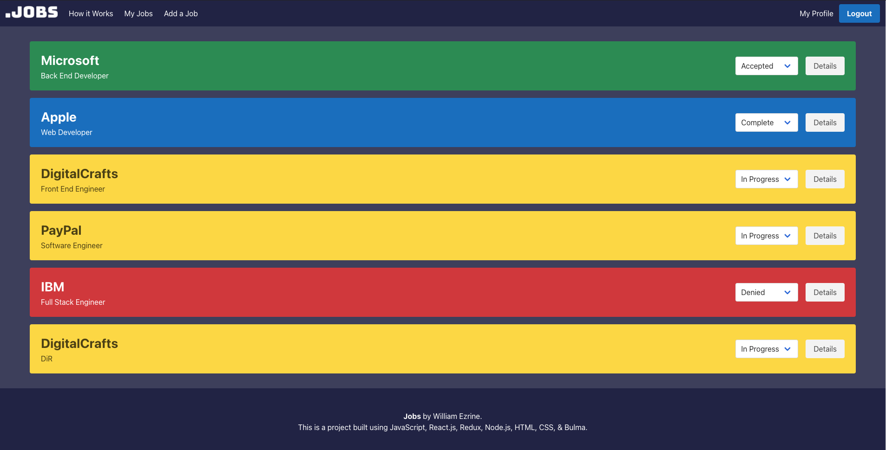
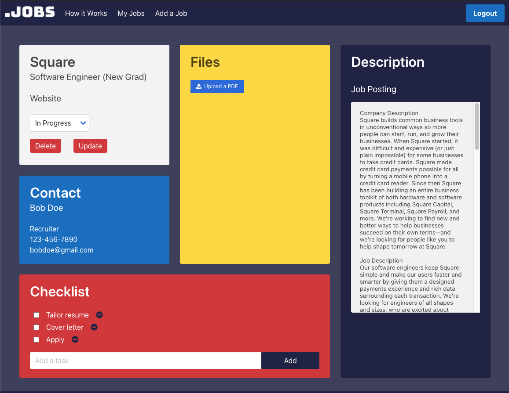
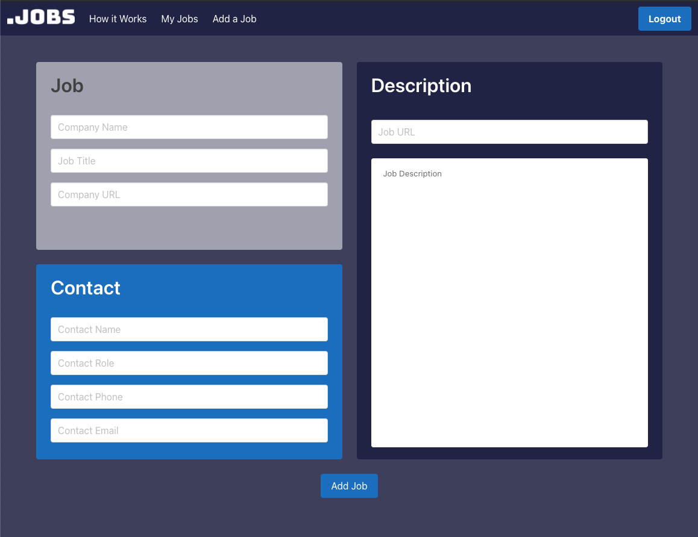

# dotJobs
dotJobs is a Full Stack React application that helps users manage their job search. It allows users to organize their job applications based on status as well as save pertinent information related to each application. With each job, the user has the option to create a checklist, upload files, and input contact information. dotJobs is the key to staying organized in what would otherwise be a stressful experience.

## Live Website
https://dotjobs.surge.sh/
 
## Build Status
Working Version 1.0
  
## Screenshots
</img>
</img>
</img>

## Tech/Framework used
<b>Built With</b> JavaScript, React, Redux. Node.js, MongoDB, HTML/CSS, and Bulma.

